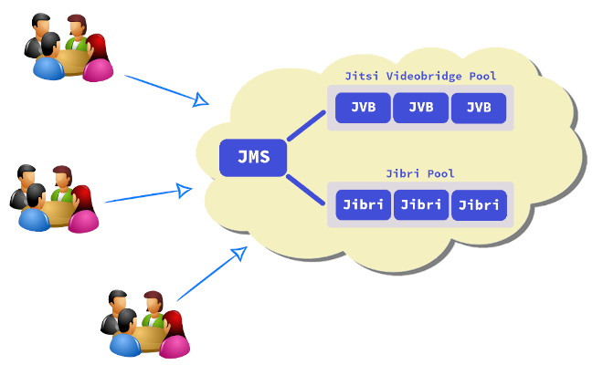

Easy way to create Jitsi cluster based on Debian Buster
=======================================================
- [1. About](#1-about)
- [2. Jitsi Meet Server (JMS)](#2-jitsi-meet-server-jms)
  - [2.1 Requirements](#21-requirements)
    - [2.1.1 DNS A record](#211-dns-a-record)
    - [2.1.2 The snd_aloop module](#212-the-snd_aloop-module)
  - [2.2 Installing JMS](#22-installing-jms)
    - [2.2.1 Downloading the installer](#221-downloading-the-installer)
    - [2.2.2 Setting the host address](#222-setting-the-host-address)
    - [2.2.3 Running the installer](#223-running-the-installer)
    - [2.2.4 Let's Encrypt certificate](#224-lets-encrypt-certificate)
- [3. Additional Jitsi Videobridge (JVB) node](#3-additional-jitsi-videobridge-jvb-node)
  - [3.1 Adding the JMS public key](#31-adding-the-jms-public-key)
  - [3.2 Adding the JVB node to the pool](#32-adding-the-jvb-node-to-the-pool)
- [4. Additional Jibri node](#4-additional-jibri-node)
  - [4.1 Adding the JMS public key](#41-adding-the-jms-public-key)
  - [4.2 Adding the Jibri node to the pool](#42-adding-the-jibri-node-to-the-pool)

---

## 1. About
This tutorial provides step by step instructions on how to create Jitsi cluster
based on Debian Buster (Debian 10).

Create or install a Debian Buster server for each node in this tutorial.
Please, don't install a desktop environment, only the standard packages...
Reserve at least 4 cores and 8 GB RAM for each node.

## 2. Jitsi Meet Server (JMS)
JMS is a standalone server with conference room, video recording and streaming
features. If the load level is low and simultaneous recording will not be made,
JMS can operate without an additional JVB or Jibri node.

Additional JVB and Jibri nodes can be added in the future if needed.

#### 2.1 Requirements
Complete the following steps before starting the installation.

##### 2.1.1 DNS A record
A resolvable host address is required for the JMS server and this address
should point to this server. Therefore, create the DNS `A record` before
starting the installation.

##### 2.1.2 The snd_aloop module
JMS needs the `snd_aloop` kernel module but some cloud computers have a kernel
that doesn't support it. In this case, first install the standart Linux kernel
and reboot the node with this kernel.

Run the following command to check the `snd_aloop` support. If the command has
an output, it means that the kernel doesn't support it.

```bash
modprobe snd_aloop
```

#### 2.2 Installing JMS
Installation will be done with
[emrah-buster](https://github.com/emrahcom/emrah-buster-templates) installer.

##### 2.2.1 Downloading the installer

```bash
wget https://raw.githubusercontent.com/emrahcom/emrah-buster-base/master/installer/eb
wget https://raw.githubusercontent.com/emrahcom/emrah-buster-templates/master/installer/eb-jitsi.conf
```

##### 2.2.2 Setting the host address
Set the host address on the installer config file `eb-jitsi.conf`. This must be
an FQDN, not IP address... Let's say the host address is `meet.mydomain.com`

```bash
echo export JITSI_HOST=meet.mydomain.com >> eb-jitsi.conf
```

##### 2.2.3 Running the installer

```bash
bash eb eb-jitsi
```

##### 2.2.4 Let's Encrypt certificate

```bash
some commands
```

## 3. Additional Jitsi Videobridge (JVB) node
A standalone JMS installation is good for a limited size of concurrent
conferences but the first limiting factor is the JVB component, that handles
the actual video and audio traffic. It is easy to scale the JVB pool
horizontally by adding as many as JVB node when needed.

#### 3.1 Adding the JMS public key
Add the JMS public key to the JVB node. On the JVB node:

```bash
mkdir -p /root/.ssh
chmod 700 /root/.ssh
wget -O - https://meet.mydomain.com/static/jms.pub >> /root/.ssh/authorized_keys
```

#### 3.2 Adding the JVB node to the pool
Let's say the IP address of the JVB node is `100.1.2.3`
On the JMS server:

```bash
add-jvb-node 100.1.2.3
```

## 4. Additional Jibri node
A standalone JMS installation can only record a limited number of concurrent
conferences but the CPU and RAM capacities are the limiting factor for the
Jibri component. It is easy to scale the Jibri pool horizontally by adding
as many as Jibri node when needed.

The Jibri node needs the `snd_aloop` module too. Therefore check the kernel
first.

#### 4.1 Adding the JMS public key
Add the JMS public key to the Jibri node. On the Jibri node:

```bash
mkdir -p /root/.ssh
chmod 700 /root/.ssh
wget -O - https://meet.mydomain.com/static/jms.pub >> /root/.ssh/authorized_keys
```

#### 4.2 Adding the Jibri node to the pool
Let's say the IP address of the Jibri node is `200.7.8.9`
On the JMS server:

```bash
add-jibri-node 200.7.8.9
```
