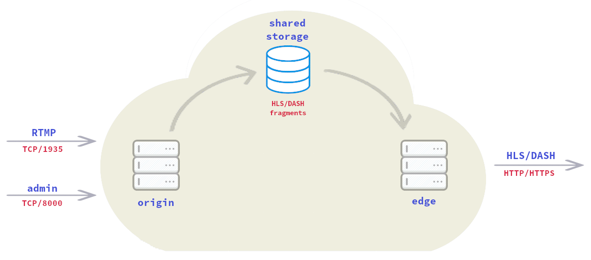

Easy way to install a live streaming media system
=================================================
- [1. About](#1-about)
- [2. Prerequisites](#2-prerequisites)
- [3. Installing](#3-installing)
  - [3.1 Downloading the installer](#31-downloading-the-installer)
  - [3.2 Running the installer](#32-running-the-installer)
  - [3.3 Let's Encrypt certificate](#33-lets-encrypt-certificate)
- [4. Usage](#4-usage)
  - [4.1 RTMP push](#41-rtmp-push)
  - [4.2 RTMP status](#42-rtmp-status)
  - [4.3 Player](#43-players)
  - [4.4 HLS/DASH pull](#44-hlsdash-pull)
  - [4.5 The stream cloner](#45-the-stream-cloner)

---

## 1. About
This tutorial provides step by step instructions on how to install a live
streaming media system on Debian Buster (Debian 10).

Create or install a Debian Buster server first and then follow the
instructions. Please, don't install a desktop environment, only the standard
packages... At least 2 cores and 4 GB RAM are recommended for this setup.

Run each command on this tutorial as `root`.


## 2. Prerequisites
If the server is behind a firewall, open the following ports:

* TCP/80
* TCP/443
* TCP/8000
* TCP/1935


## 3. Installing
Installation will be done with
[emrah-buster](https://github.com/emrahcom/emrah-buster-templates) installer.

#### 3.1 Downloading the installer
```bash
wget https://raw.githubusercontent.com/emrahcom/emrah-buster-base/master/installer/eb
wget https://raw.githubusercontent.com/emrahcom/emrah-buster-templates/master/installer/eb-livestream.conf
```

#### 3.2 Running the installer

```bash
bash eb eb-livestream
```

#### 3.3 Let's Encrypt certificate
This is optional. You don't have to use a certificate.

Let's say the host address is `live.mydomain.com`
To set the Let's Encrypt certificate:

```bash
set-letsencrypt-cert live.mydomain.com
```


## 4. Usage
The streaming media system has two containers:

* Origin
* Edge

The `origin` container listens the RTMP port for the coming stream and converts
it to the `HLS` and `DASH` formats. `H.264` and `AAC` supported.

The `edge` container publishes the `HLS` and `DASH` fragments over `http` and
`https`.

#### 4.1 RTMP push
Use the following link format to push an RTMP stream:

```
rtmp://<HOST_ADDRESS>/livestream/<CHANNEL_NAME>
```

#### 4.2 RTMP status
Use the following link to check the RTMP status:

```
http://<HOST_ADDRESS>:8000/livestream/status
```

#### 4.3 Players
Use the following link formats for the player pages.

**HLS player**

```
http://<HOST_ADDRESS>/livestream/hlsplayer/<CHANNEL_NAME>
```

**DASH player**

```
http://<HOST_ADDRESS>/livestream/dashplayer/<CHANNEL_NAME>
```

#### 4.4 HLS/DASH pull
Use the following link formats to pull a stream.

**HLS stream**

```
http://<HOST_ADDRESS>/livestream/hls/<CHANNEL_NAME>/index.m3u8
```

**DASH stream**

```
http://<HOST_ADDRESS>/livestream/dash/<CHANNEL_NAME>/index.mpd
```

#### 4.5 The stream cloner
The stream cloner publishes a stream to the multiple locations (Youtube,
Facebook etc.) simultaneously.

The stream cloner link is

```
http://<HOST_ADDRESS>:8000/livestream/cloner
```

